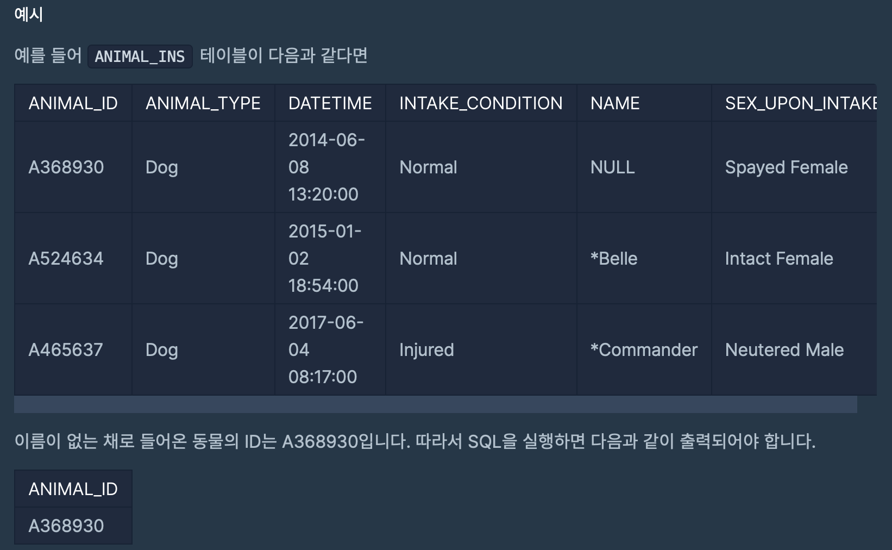
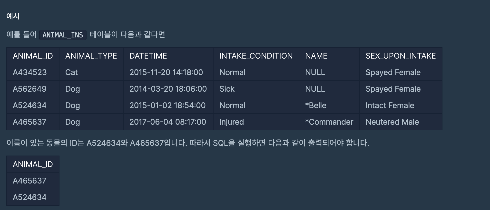
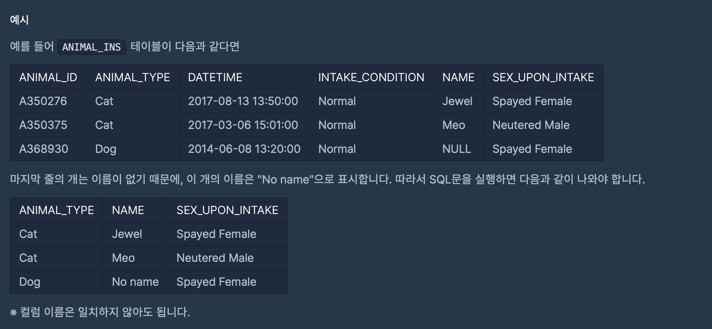

# 프로그래머스 SQL 문제 풀이
## 문제 15 ~ 문제 17
`ANIMAL_INS` 테이블은 동물 보호소에 들어온 동물의 정보를 담은 테이블입니다. <br><br>
[ ANIMAL_INS 테이블 구조 ] <br>
`ANIMAL_ID` : 동물의 아이디 <br>
`ANIMAL_TYPE` : 생물 종 <br>
`DATETIME` : 보호 시작일 <br>
`INTAKE_CONDITION` : 보호 시작 시 상태  <br>
`NAME` : 이름 <br>
`SEX_UPON_INTAKE` : 성별 및 중성화 여부<br><br>

### 15. 이름이 없는 동물의 아이디
> 동물 보호소에 들어온 동물 중, 이름이 없는 채로 들어온 동물의 ID를 조회하는 SQL 문을 작성해주세요.

<br>


```sql
SELECT ANIMAL_ID
FROM ANIMAL_INS
WHERE NAME IS NULL
```
<br>

#### `ISNULL`
- SQL server의 내장함수이며 `컬럼이 NULL 값일 경우`, 다른 값으로 대체할 수 있는 기능이 있다. 
- 사용법
    ```sql
    ISNULL(칼럼, 칼럼이 NULL일 경우 대체할 값)
    ```

<br>

### 16. 이름이 있는 동물의 아이디
> 동물 보호소에 들어온 동물 중, 이름이 있는 동물의 ID를 조회하는 SQL 문을 작성해주세요. 단 ID는 오름차순 정렬되어야 합니다. 



```sql
SELECT ANIMAL_ID
FROM ANIMAL_INS
WHERE NAME IS NOT NULL
ORDER BY ANIMAL_ID
```
<br>

### 17. NULL 처리하기 
> 입양 게시판에 동물 정보를 게시하려 합니다. 동물의 생물 종, 이름, 성별 및 중성화 여부를 아이디 순으로 조회하는 SQL문을 작성해주세요. 이때 프로그래밍을 모르는 사람은 NULL이라는 기호를 모르기 때문에, 이름이 없는 동물의 이름은 "NO name"으로 표시해 주세요



```sql
SELECT ANIMAL_TYPE,
        IFNULL(NAME, "No name") AS NAME,
        SEX_UPON_INTAKE
FROM ANIMAL_INS
```
<br>

### Column 값이 NULL인 경우를 처리해주는 함수 : `IFNULL`, `CASE`, `COALESCE`
<br>

#### `IFNULL`
- 해당 Column의 값이 NULL 을 반환할 때, 다른 값으로 출력할 수 있도록 하는 함수
    ```sql
    SELECT IFNULL(Column명, "Null일 경우 대체 값") 
    FROM 테이블 명
    ```

#### `IF()`
- NULL 처리는 IF와 ISNULL 조건으로도 가능하다. 
    ```sql
    SELECT IF(IS NULL(NAME), "No name", NAME) as NAME
    FROM ANIMAL_INS
    ```

#### `ISNULL()`
- IF와는 다르다!
    ```sql
    -- NAME Column이 NULL인 경우 "No name"을, Null이 아닌 경우 NAME Column의 값을 출력
        SELECT ISNULL(NAME, "No name") as NAME
        FROM ANIMAL_INS
    ```

#### `CASE()`
- 조건식을 통해 Column값을 T/F로 판단하여 조건에 맞게 Column값을 변환할 때 사용
- 기본구조
    ```sql
    CASE 
        WHEN 조건식1 THEN 식1
        WHEN 조건식1 THEN 식1
        ...
        ELSE 조건에 맞지 않는 경우, 실행할 식
    END
    ```
