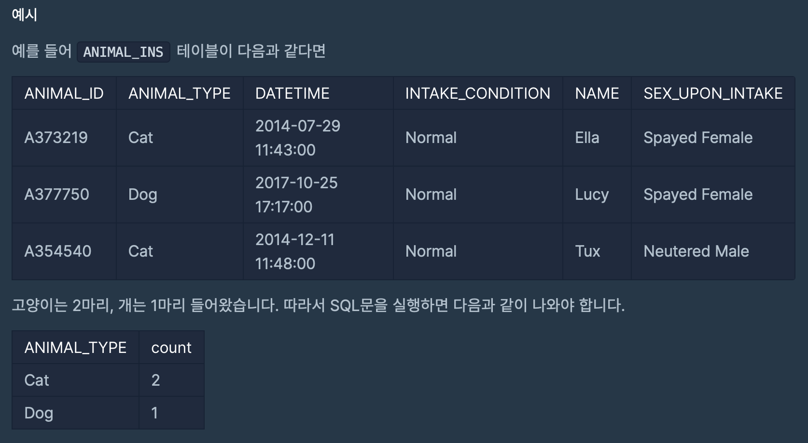
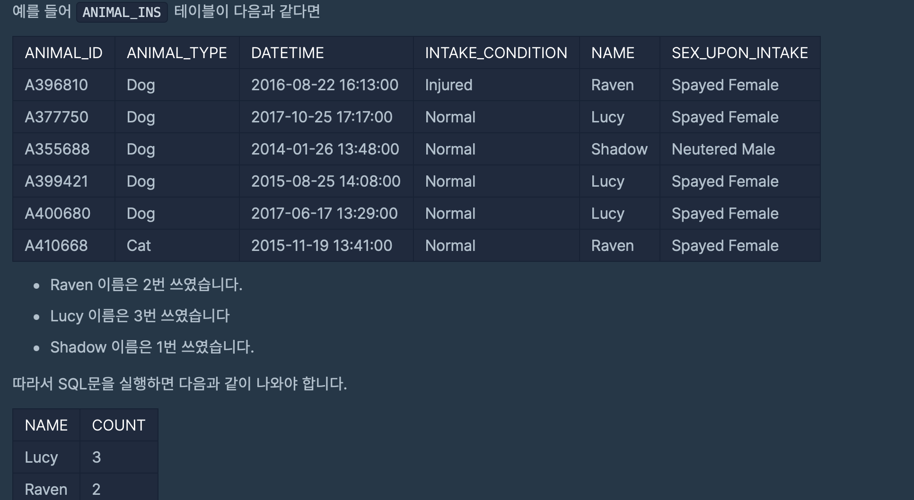
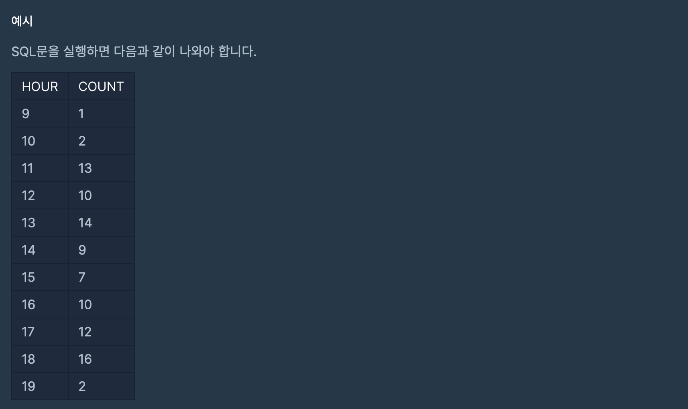

# 프로그래머스 SQL 문제 풀이
#### GROUP BY
- 특정 속성을 기준으로 그룹화 하여 검색할 때 그룹화 할 속성을 지정
- 그룹 함수를 `GROUP BY`절에 지정된 `컬럼의 값이 같은 행에 대해서 통계를 계산`하라는 의미
- 기본 구조
    ```sql
    SELECT [DISTINCT] 컬럼, 그룹함수(컬럼)
    FROM 테이블명
    [WHERE 조건]
    [GROUP BY 그룹 대상]
    [ORDER BY 정렬대상 [ASC/DESC]]
    ```
- SELECT 절에 `그룹 함수와 컬럼명이 함께 기술된 경우`에는 반드시 `해당 컬럼을 GROUP BY로 그룹화` 해주어야 한다. 
- 그룹 함수의 결과 값은 GROUP BY 절에 기술된 컬럼의 항목들의 행의 개수에 의해 결정된다. 
- 그룹 함수가 중첩된 경우 GROUP BY 절에 기술한 컬럼도 출력할 수 없다. 

<br>

#### HAVING 
- WHERE 절과 동일
- HAVING은 `조건 내용에 그룹 함수를 포함`한다. 
- `일반 조건은 WHERE절`에 기술하지만 `그룹 함수를 포함한 조건은 HAVING 절`에 기술한다. 
- HAVING 절은 `GROUP BY 절 뒤에 기술`한다. 
- 기본 구조
    ```sql
    SELECT [DISTINCT] 컬럼, 그룹함수(컬럼)
    FROM 테이블명
    [WHERE 조건]
    [GROUP BY 그룹 대상]
    [HAVING 그룹 함수 포함된 조건]
    [ORDER BY 정렬대상 [ASC/DESC]]
    ```
<br>

---
<br>

## 문제 11 ~ 문제 14
`ANIMAL_INS` 테이블은 동물 보호소에 들어온 동물의 정보를 담은 테이블입니다. <br><br>
[ ANIMAL_INS 테이블 구조 ] <br>
`ANIMAL_ID` : 동물의 아이디 <br>
`ANIMAL_TYPE` : 생물 종 <br>
`DATETIME` : 보호 시작일 <br>
`INTAKE_CONDITION` : 보호 시작 시 상태  <br>
`NAME` : 이름 <br>
`SEX_UPON_INTAKE` : 성별 및 중성화 여부<br><br>

`ANIMAL_OUTS` 테이블은 동물 보호소에 입양 보낸 동물의 정보를 담은 테이블입니다. <br><br>
[ ANIMAL_OUTS 테이블 구조 ] <br>
`ANIMAL_ID` : 동물의 아이디 <br>
`ANIMAL_TYPE` : 생물 종 <br>
`DATETIME` : 입양일 <br>
`NAME` : 이름 <br>
`SEX_UPON_INTAKE` : 성별 및 중성화 여부<br><br>

### 11. 고양이와 개는 몇 마리 있을까?
> 동물보호소에 들어온 동물 중 고양이와 개가 각각 몇마리인지 조회하는 SQL문을 작성해주세요. 이때, 고양이를 개보다 먼저 조회해주세요



```sql
SELECT ANIMAL_TYPE, count(ANIMAL_TYPE) AS count
FROM ANIMAL_INS
GROUP BY ANIMAL_TYPE
ORDER BY ANIMAL_TYPE
```
<br>

### 12. 동물의 수 찾기
> 동물 보호소에 들어온 동물 이름 중 두 번 이상 쓰인 이름과 해당 이름이 쓰인 횟수를 조회하는 SQL문을 작성해주세요. 이때 결과는 이름이 없는 동물은 집계에서 제외하며, 결과는 이름 순으로 조회해주세요

<br>



```sql
SELECT NAME, count(NAME) AS COUNT
FROM ANIMAL_INS
GROUP BY NAME
HAVING COUNT >= 2
ORDER BY NAME
```
<br>

### 13. 입양 시각 구하기(1) 
> 보호소에서는 몇 시에 입양이 가장 활발하게 일어나는지 알아보려 합니다. 09:00부터 19:59까지, 각 시간대별로 입양이 몇 건이나 발생했는지 조회하는 SQL문을 작성해주세요. 이때 결과는 시간대 순으로 정렬해야 합니다. 

<br>



```sql
SELECT HOUR(DATETIME) HOUR , COUNT(HOUR(DATETIME)) COUNT
FROM ANIMAL_OUTS
WHERE HOUR(DATETIME) >= 9  AND HOUR(DATETIME) < 20
GROUP BY HOUR(DATETIME)
ORDER BY HOUR(DATETIME)
```
<br>

### 14. 입양 시각 구하기(2)
> 보호소에서는 몇 시에 입양이 가장 활발하게 일어나는지 알아보려 합니다. 0시부터 23시까지, 각 시간대별로 입양이 몇건이나 발생했는지 조회하는 SQL 문을 작성해주세요. 이때 결과는 시간대 순으로 정렬해야 합니다. 

<br>

```sql
SET @HOUR = -1;

SELECT (@HOUR:=@HOUR+1) , (SELECT count(HOUR(DATETIME)) 
                            FROM ANIMAL_OUTS
                            WHERE HOUR(DATETIME)=@HOUR) AS COUNT
FROM ANIMAL_OUTS
WHERE @HOUR <23;
```
<br>

#### 변수 선언 및 값 출력
```sql
-- 변수 선언
DECLARE @변수이름 데이터형식

-- 변수에 값 대입
SET @변수이름 = 변수의 값

-- 변수의 값 출력
SELECT @변수이름
```

