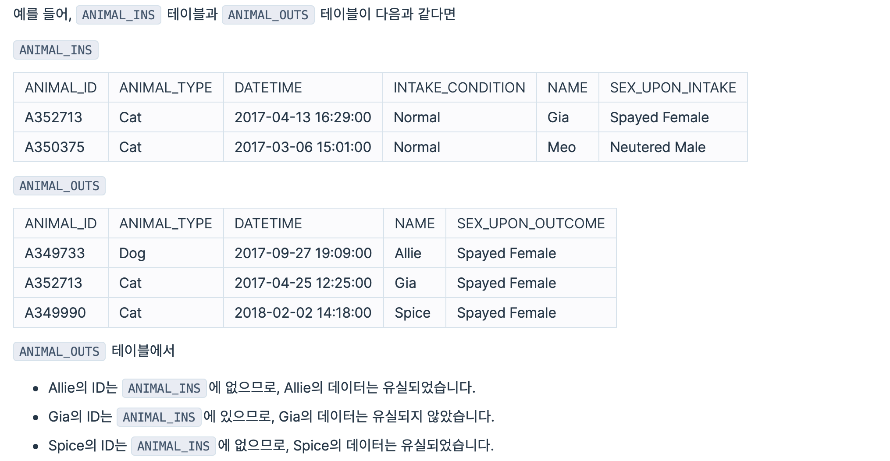
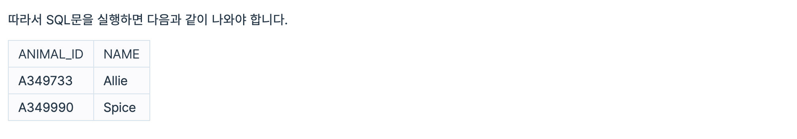
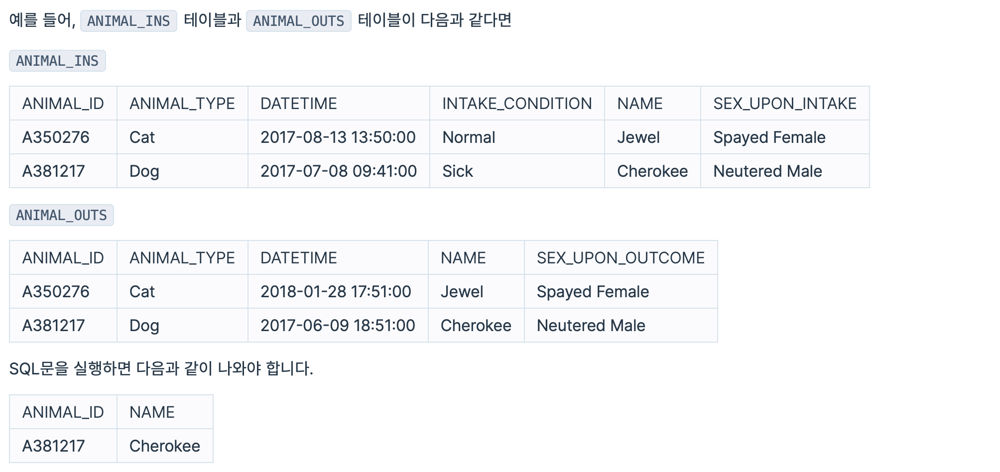
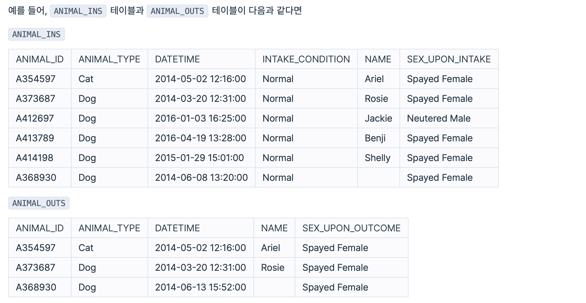
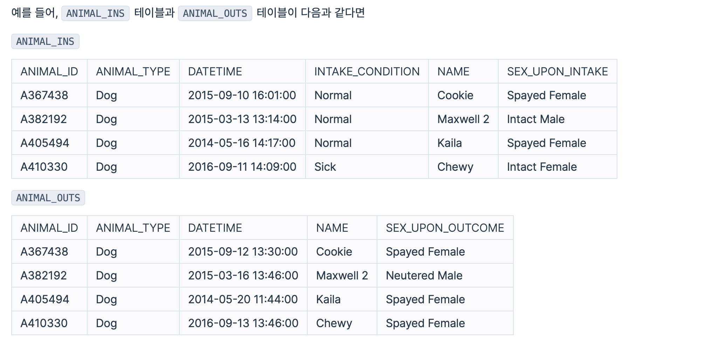
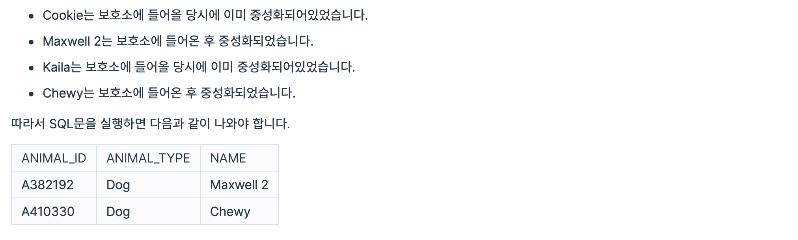

# 프로그래머스 SQL 문제 풀이

### 문제 15 ~ 문제 18

`ANIMAL_INS` 테이블은 동물 보호소에 들어온 동물의 정보를 담은 테이블입니다. <br><br>
[ ANIMAL_INS 테이블 구조 ] <br>
`ANIMAL_ID` : 동물의 아이디 <br>
`ANIMAL_TYPE` : 생물 종 <br>
`DATETIME` : 보호 시작일 <br>
`INTAKE_CONDITION` : 보호 시작 시 상태  <br>
`NAME` : 이름 <br>
`SEX_UPON_INTAKE` : 성별 및 중성화 여부<br><br>

`ANIMAL_OUTS` 테이블은 동물 보호소에 입양 보낸 동물의 정보를 담은 테이블입니다. <br><br>
[ ANIMAL_OUTS 테이블 구조 ] <br>
`ANIMAL_ID` : 동물의 아이디 <br>
`ANIMAL_TYPE` : 생물 종 <br>
`DATETIME` : 입양일 <br>
`NAME` : 이름 <br>
`SEX_UPON_INTAKE` : 성별 및 중성화 여부<br><br>

ANIMAL_OUTS 테이블의 ANIMAL_ID는 ANIMAL_INS의 ANIMAL_ID의 외래 키입니다.
<br>
<br>

### 15. 없어진 기록
> 천재지변으로 인해 일부 데이터가 유실되었습니다. 입양을 간 기록은 있는데, 보호소에 들어온 기록이 없는 동물의 ID 와 이름을 ID 순으로 조회하는 SQL 문을 작성해주세요
<br>




```sql
SELECT OUTS.ANIMAL_ID, OUTS.NAME
FROM ANIMAL_INS INS RIGHT JOIN ANIMAL_OUTS OUTS
ON INS.ANIMAL_ID = OUTS.ANIMAL_ID
WHERE INS.ANIMAL_ID IS NULL
ORDER BY OUTS.ANIMAL_ID
```
<br><br>
### 16. 있었는데요 없었습니다.
> 관리자의 실수로 일부 동물의 입양일이 잘못 입력되었습니다. 보호 시작일보다 입양일이 더 빠른 동물의 아이디와 이름을 조회하는 SQL문을 작성해주세요. 이때 결과는 보호 시작일이 빠른 순으로 조회해야합니다. 



```SQL
SELECT INS.ANIMAL_ID, INS.NAME
FROM ANIMAL_INS INS JOIN ANIMAL_OUTS OUTS
ON INS.ANIMAL_ID = OUTS.ANIMAL_ID
WHERE INS.DATETIME > OUTS.DATETIME
ORDER BY INS.DATE
```
<br>
<br>

### 17. 오랜기간 보호한 동물(1)
> 아직 입양을 못 간 동물 중, 가장 오래 보호소에 있었던 동물 3마리의 이름과 보호 시작일을 조회하는 SQL문을 작성해주세요. 이때 결과는 보호 시작일 순으로 조회해야한다. 




<br>

```sql
SELECT INS.NAME, INS.DATETIME
FROM ANIMAL_INS INS LEFT JOIN ANIMAL_OUTS OUTS
ON INS.ANIMAL_ID = OUTS.ANIMAL_ID
WHERE OUTS.ANIMAL_ID IS NULL
ORDER BY INS.DATETIME 
LIMIT 3
```

### 18.보호소에서 중성화한 동물
> 보호소에서 중성화 수술을 거친 동물 정보를 알아보려 한다. 보호소에 들어올 당시에는 중성화 되지 않았지만, 보호소를 나갈 당시에는 중성화된 동물의 아이디와 생물 종, 이름을 조회하는 아이디 순으로 조회하는 SQL 문을 작성해 주세요
<br>
중성화를 거치지 않은 동물은 성별 및 중성화 여부에 Intact, 중성화를 거친 동물은 Spayed 또는 Neutered라고 표시되어있습니다.





<br>

```sql
SELECT OUTS.ANIMAL_ID, OUTS.ANIMAL_TYPE , OUTS.NAME
FROM ANIMAL_INS INS JOIN ANIMAL_OUTS OUTS
ON INS.ANIMAL_ID LIKE OUTS.ANIMAL_ID
WHERE INS.SEX_UPON_INTAKE LIKE 'Intact%' AND (OUTS.SEX_UPON_OUTCOME LIKE 'Spayed%' OR OUTS.SEX_UPON_OUTCOME LIKE 'Neutered%')
```