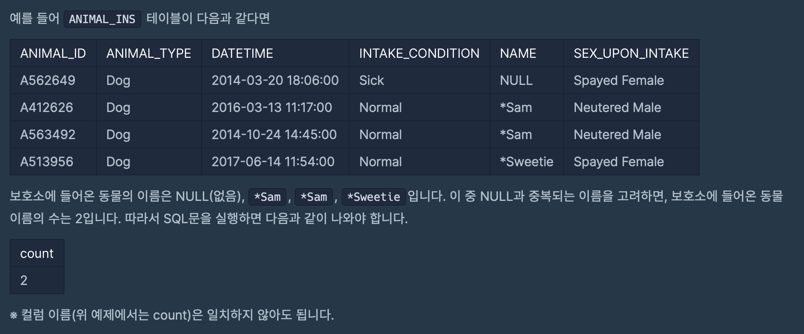

# 프로그래머스 문제 풀이
## 문제 07 ~ 문제 10
`ANIMAL_INS` 테이블은 동물 보호소에 들어온 동물의 정보를 담은 테이블입니다. <br><br>
[ ANIMAL_INS 테이블 구조 ] <br>
`ANIMAL_ID` : 동물의 아이디 <br>
`ANIMAL_TYPE` : 생물 종 <br>
`DATETIME` : 보호 시작일 <br>
`INTAKE_CONDITION` : 보호 시작 시 상태  <br>
`NAME` : 이름 <br>
`SEX_UPON_INTAKE` : 성별 및 중성화 여부<br><br>

### 07. 최대값 구하기
> 가장 최근에 들어온 동물은 언제 들어왔는지 조회하는 SQL 문을 작성해주세요


```sql
SELECT DATETIME AS '시간'
FROM ANIMAL_INS
ORDER BY DATETIME desc LIMIT 1
```
<br>

### 08. 최솟값 구하기 
> 동물 보호소에 가장 먼저 들어온 동물은 언제 들어왔는지 조회하는 SQL 문을 작성해주세요 
<br>


<br>

```sql
SELECT DATETIME AS '시간'
FROM ANIMAL_INS
ORDER BY DATETIME LIMIT 1
```

<br>

### 09. 동물 수 구하기 
> 동물 보호소에 동물이 몇마리 들어왔는지 조회하는 SQL 문을 작성해주세요
<br>


```sql
SELECT count(*) AS count
FROM ANIMAL_INS
```
<br>

### 10. 중복 제거하기 
> 동물 보호소에 들어온 동물의 이름은 몇 개인지 조회하는 SQL 문을 작성해주세요. 이때 이름이 NULL인 경우는 집계하지 않으며 중복되는 이름은 하나로 생각한다. 

<br>


<br>

```sql
SELECT count(DISTIMCT NAME) AS count
FROM ANIMAL_INS
WHERE NAME != 'NULL'
```
<br>

#### 중복 제거 
- `DISTINCT` : 중복을 없애주지만 정렬을 해주지 않는다.
    ```sql
    SELECT DISTINCT {컬럼명} FROM {테이블명} {조건절} 
    ``` 
- `GROUP BY` : 중복을 없애주고 정렬도 해준다. 
    ```sql
    SELECT {컬럼명} FROM {테이블명} {조건절} GROUP BY {테이블명}
    ```

<br>