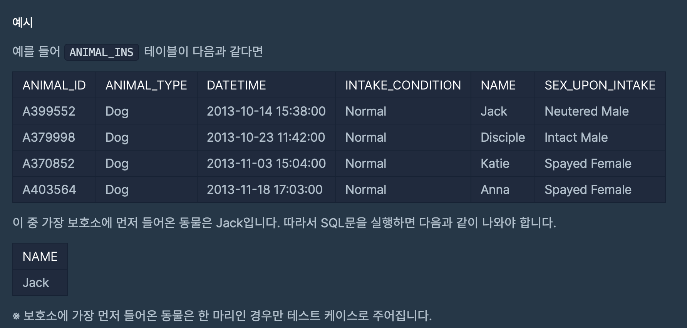

# 프로그래머스 SQL 문제 풀이 
## 문제 01 ~ 문제 07
`ANIMAL_INS` 테이블은 동물 보호소에 들어온 동물의 정보를 담은 테이블입니다. <br><br>
[ ANIMAL_INS 테이블 구조 ] <br>
`ANIMAL_ID` : 동물의 아이디 <br>
`ANIMAL_TYPE` : 생물 종 <br>
`DATETIME` : 보호 시작일 <br>
`INTAKE_CONDITION` : 보호 시작 시 상태  <br>
`NAME` : 이름 <br>
`SEX_UPON_INTAKE` : 성별 및 중성화 여부<br><br>

### 01. 모든 레코드 조회하기 
> 동물 보호소에 들어온 모든 동물의 정보를 ANIMAL_ID순으로 조회하는 SQL문을 작성해주세요.


```sql
SELECT *
FROM ANIMAL_INS 
ORDER BY ANIMAL_ID
```
<br>

### 02. 역순 정렬하기 
> 동물 보호소에 들어온 모든 동물의 이름과 보호 시작일을 조회하는 SQL문을 작성해주세요. 


```sql
SELECT NAME, DATATIME
FROM ANIMAL_INS
ORDER BY ANIMAL_ID desc
```
<br>

### 03. 아픈 동물 찾기 
> 동물 보호소에 들어온 아픈 동물의 아이디와 이름을 조회하는 SQL 문을 작성해주세요. 결과는 id수능로 조회해주세요 <br>
아픈 동물 : `INTAKE_CONDITION`이 Sick 인 경우를 뜻함 <br>


```sql
SELECT ANLIMAL_ID, NAME
FROM ANIMAL_INS
WHERE INTAKE_CONDITION = 'Sick'  
ORDER BY ANIMAL_ID
```
<br>

### 04. 어린 동물 찾기
> 동물 보호소에 들어온 동물 중 젊은 동물의 아이디와 이름을 조회하는 sql문을 작성해 주세요. 이때 결과는 아이디 순으로 조회해주세요

젊은 동물 : `INTAKE_CONDITION`이 Aged가 아닌 경우를 뜻함 
<br>


```sql
SELECT ANLIMAL_ID, NAME
FROM ANIMAL_INS
WHERE INTAKE_CONDITION != 'Aged'
ORDER BY ANIMAL_ID
```
<br>

### 05. 동물의 아이디와 이름
> 동물 보호소에 들어온 모든 동물의 아이디와 이름을 ANIMAL_ID 순으로 조회하는 SQL 문으로 작성해주세요. 
<br>


```sql
SELECT ANIMAL_ID, NAME
FROM ANIMAL_INS
ORDER BY ANIMAL_ID
```
<br>

### 06.여러 기준으로 정렬하기
> 동물 보호소에 들어온 모든 동물의 아이디와 이름, 보호 시작일을 이름 순으로 조회하는 SQL문을 작성해 주세요. 단, 이름이 같은 동물 중에서는 보호를 나중에 시작한 동물을 먼저 보여줘야 합니다. 
<br>


<br>

```sql
SELECT ANIMAL_ID, NAME, DATETIME
FROM ANIMAL_INS
ORDER BY NAME, DATETIME desc
```

<br>

### 07.상위n개 레코드
> 동물 보호소에 가장 먼저 들어온 동물의 이름을 조회하는 SQL 문을 작성해주세요
<br>



```sql
SELECT NAME
FROM ANIMAL_INS
ORDER BY DATETIME LIMIT 1
```

#### LIKE 구문
1. ` _ ` : 글자수를 정해줌 (ex, 컬럼명 LIKE '홍_동') <br>
2. ` % ` : 글자숫자를 정해주지 않는다. (ex, 컬럼명 LIKE '홍%')
<br>

```sql
-- A로 시작하는 문자 찾기 
SELECT 컬럼명 FROM 테이블 WHERE 컬럼명 LIKE 'A%'

-- A로 끝나는 문자 찾기 
SELECT 컬럼명 FROM 테이블 WHERE 컬럼명 LIKE '%A'

-- A를 포함하는 문자 찾기 
SELECT 컬럼명 FROM 테이블 WHERE 컬럼명 LIKE '%A%'

-- A로 시작하는 두글자 문자 찾기 
SELECT 컬럼명 FROM 테이블 WHERE 컬럼명 LIKE 'A_'

-- 첫번째 문자가 'A'가 아닌 모든 문자열 찾기 
SELECT 컬럼명 FROM 테이블 WHERE 컬럼명 LIKE '[^A]'

-- 첫번째 문자가 'A'또는 'B'또는 'C'인 문자열 찾기 
SELECT 컬럼명 FROM 테이블 WHERE 컬럼명 LIKE '[ABC]'
SELECT 컬럼명 FROM 테이블 WHERE 컬럼명 LIKE '[A-C]'
```

